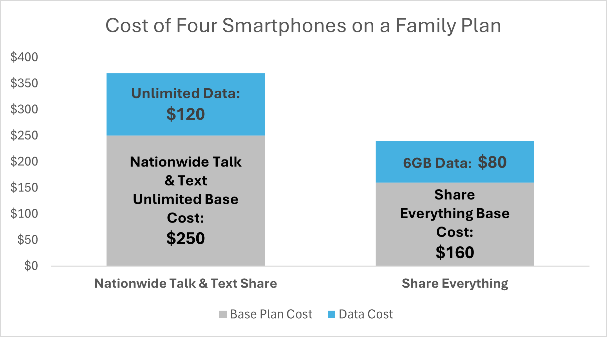

There were major changes in communication technology over the decade 2005-2015 boosting speeds of data transfer and altering how we communicate as we moved away from voice-calling toward web-based forms. A grand orchestration of innovation lends to this symphony of change with the introduction of smartphones and the iPhone's release in 2007, the advancement of LTE technology boosting internet data transfer and changes to how we contract and pay for these services which is the focus of this paper. 

Verizon’s former pricing model focused monetization heavily on voice minutes and text messages but included options for data. A bucket of minutes was purchased and shared between lines on a plan. For smartphones, data was purchased for each device separately. Tablets could be connected to the internet through Verizon as well but not through the same plan. Instead separate agreements for created for each device with a range of data and price tiers to choose from thereby competing with the glorious ease of a WiFi-connection.  

In 2012, the Share Everything plan changed all of this by streamlining how we contract for services. Under the new structure, one bucket of data is purchased in one step and then shared between devices on the plan. It also moved beyond just phones to allowing all internet-enabled devices including tablets to enroll on the family plan and thus share in the data pool. This reduced the complexity of connecting new devices to the internet. Before 2010, most customers relied on carriers only for their phones but by 2014, over 22% of tablets sold were cellularly enabled. For Verizon the ease of connecting more devices to the family plan meant an expansion of the number of devices under the Verizon umbrella, more market share and thus more traction - price stickiness. 

Furthermore, the new structure facilitate more differentiation on data usage. 
To further illuminate, a Family Nationwide Share Talk and Text Plan with four smartphones had a base price of $250, and if three members of the family use only 1 GB of data and another is a more intensive user at about 3 GB every month, the data add-on for each device cost $30 or $120 total. That's a total cost of $370. 
For a family that only requires 6 GB of data, Share Everything changes that equation with a family plan base cost of $160 for the four devices, and then instead of purchasing data for each device, 6GB of data is added to the plan for 80 dollars and that 6GB is shared by all four devices resulting in a total of $240. See chart below. 

